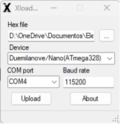

# Proceso de subir firmware al Smart Sprinkler

## Smart Sprinkler - Basic Pack
El microcontrolador ATmega328p necesita de un programador especial para subir códigos. Sin embargo, con la llegada de Arduino, es posible subir fácilmente códigos sin depender de un programador específico. Para que esto sea posible, se necesita adquirir un microcontrolador pre grabado con un bootloader o en su defecto, grabar el bootloader nosotros mismos.

En caso no podamos conseguir un ATmega328p con el bootloader pre grabado, y como estamos usando un chip en su formato TQFP32, necesitaremos un adaptador y un Arduino UNO o NANO para poder realizar el grabado del bootloader al nuevo chip.

El proceso se detalla en el siguiente video:

https://www.youtube.com/watch?v=3D5gwxtuSlI

Luego de haber realizado los pasos previos, de aquí en adelante cualquier actualización de firmware se realiza de la siguiente manera:

### Paso 1:
Descargar la herramienta xLoader.

https://github.com/binaryupdates/xLoader

### Paso 2:
Abrir la aplicación xLoader.exe

### Paso 3:
Seleccionar el microcontrolador Nano(ATmega328).

### Paso 4:
Buscamos el archivo firmware.hex, que es el firmware que vamos a subir al dispositivo.

### Paso 5:
Conectamos el dispositivo a uno de los puertos USB de la computadora, después de unos segundos deberíamos buscar el puerto COM asignado. También debemos asegurarnos de que la velocidad de BAUD sea 115200.

### Paso 6:
Finalmente, le damos UPLOAD para iniciar la grabación del firmware al dispositivo. Si todo salió correctamente, deberías ver algo similar.

